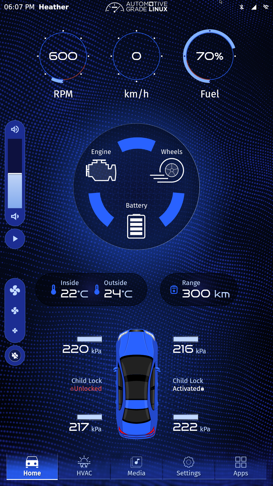
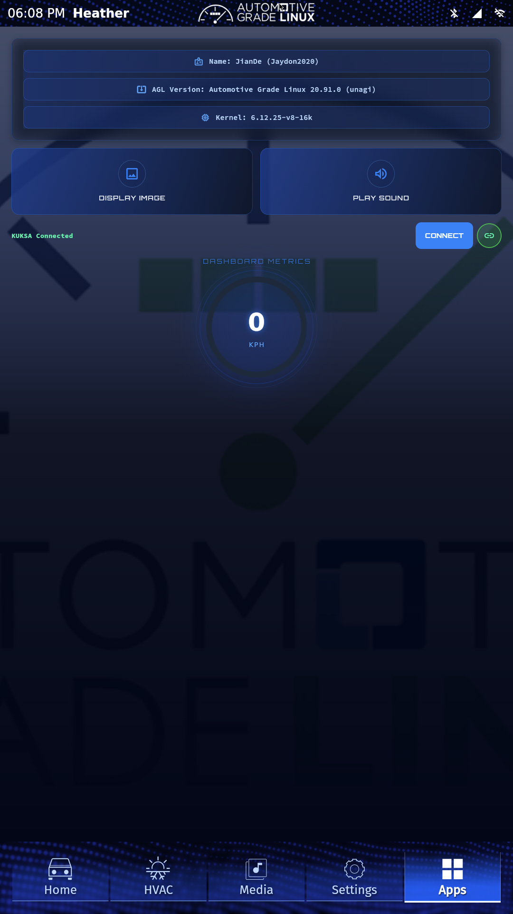
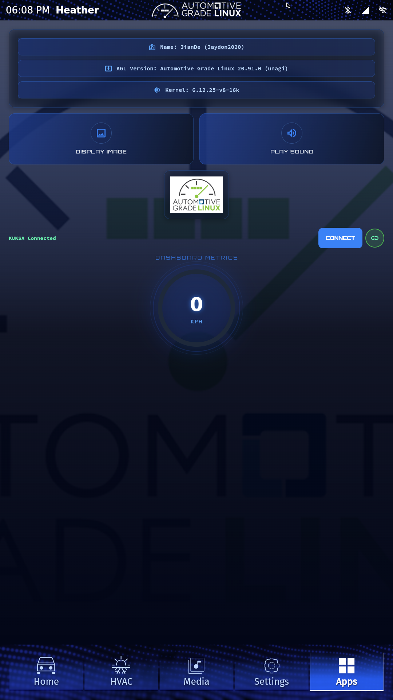

# AGL Flutter Quiz Demo

A simple Flutter application for Automotive Grade Linux (AGL) that demonstrates integration with AGL's salmon branch. It features a dashboard UI with KUKSA integration.

## Overview
This repository contains a Flutter application specifically designed to run on the AGL platform. The application demonstrates integration of Flutter with AGL's salmon branch. It features a UI that displays a dashboard, button-activated image, and audio playback.

## Features
- Flutter UI optimized for automotive displays
- Integration with AGL framework
- KUKSA databroker integration for vehicle signals (e.g., Vehicle.Speed)
- Button-activated image display and sound playback

## Prerequisites
To build and deploy this application, you will need:
- Ubuntu 22.04 LTS (Jammy Jellyfish)
- Git
- Python 3 and pip
- [meta-flutter/workspace-automation](https://github.com/meta-flutter/workspace-automation)
- Yocto Project tooling
- AGL master branch

## AGL Integration Details
Following steps were taken to integrate this app into AGL image.

### 1. Build AGL locally
The 'agl-ivi-demo-flutter' of the AGL branch was built locally and tested using QEMU and on Raspberry Pi 5. For detailed instructions on how to build the AGL image for x86 (Emulation), please refer to the [AGL Official Documentation](https://docs.automotivelinux.org/en/trout/#01_Getting_Started/02_Building_AGL_Image/06_Building_the_AGL_Image/02_Building_for_x86_%28Emulation_and_Hardware%29/).

**Pre-built images for Raspberry Pi 5 are available [here](https://github.com/jaydon2020/AGL26-yocto-layer/releases/tag/v1.0).**

### 2. Add Yocto recipe for our flutter app
Under the `recipes-demo` folder create a new directory named `gsoc26-flutter-quiz`. This directory contains a `.bb` file with the following recipe (also available in the [AGL26 Yocto Layer](https://github.com/jaydon2020/AGL26-yocto-layer)):

```bb
SUMMARY = "AGL Flutter Hello World Application"
HOMEPAGE = "https://github.com/jaydon2020/AGL-2026-Flutter-Quiz"
LICENSE = "CLOSED"
SECTION = "graphics"
PV = "1.0+git${SRCREV}"
SRC_URI = "git://github.com/jaydon2020/AGL-2026-Flutter-Quiz.git;protocol=https;branch=main"
SRCREV = "${AUTOREV}"
S = "${WORKDIR}/git"

inherit flutter-app agl-app
# Dependencies needed for D-Bus and Audioplayers Linux
DEPENDS += " \
    glib-2.0 \
    dbus \
    gstreamer1.0 \
    gstreamer1.0-plugins-base \
"

RDEPENDS:${PN} += " \
    gstreamer1.0 \
    gstreamer1.0-plugins-base \
    gstreamer1.0-plugins-good \
"

PUBSPEC_APPNAME = "gsoc26_flutter_quiz"
PUBSPEC_IGNORE_LOCKFILE = "1"
FLUTTER_APPLICATION_INSTALL_PREFIX = "/usr/share/flutter"
AGL_APP_TEMPLATE = "agl-app-flutter"
AGL_APP_NAME = "AGL GSoC 2026 Flutter Quiz"
AGL_APP_ID = "gsoc26_flutter_quiz"
```

### 3. Add app to the AGL image

To include the app in the final image, we append it to the `AGL_APPS_INSTALL` variable in the `meta-agl-demo/recipes-platform/images/agl-ivi-demo-flutter.bb` file:

```bb
require agl-ivi-image-flutter.bb

SUMMARY = "AGL IVI demo Flutter image"

KUKSA_CONF = "kuksa-conf"

# import default music data package if PREINSTALL_MUSIC is set to "1"
MUSICDATA ?= "${@oe.utils.conditional("PREINSTALL_MUSIC", "1", "pre-install-music-data", "", d)}"

AGL_APPS_INSTALL += " \
    flutter-ics-homescreen \
    ${KUKSA_CONF} \
    camera-gstreamer \
    window-management-client-grpc \
    agl-shell-activator \
    ondemandnavi \
    ${MUSICDATA} \
    gsoc26-flutter-quiz \
"
```

### 4. Build the image again

In order for our changes to be reflected we need to re-build the updated recipes and then build the entire image again. Following commands will achieve this:

```bash
$ source agl-init-build-env
$ bitbake gsoc26-flutter-quiz
$ bitbake agl-ivi-demo-flutter
```

This will take a couple of minutes depending upon system speed.

### 5. Running our image using qemu
Now it's time to see if our newly added app works as intended or not.

Please refer [AGL Quickstart - Using Ready Made Images](https://docs.automotivelinux.org/en/trout/#01_Getting_Started/01_Quickstart/01_Using_Ready_Made_Images/)

The image will be at `tmp/deploy/images/{machine-name}/agl-*`

The AGL image will run in the background. We can use Vinagre to open it. The "AGL Flutter Quiz" should be visible inside the AGL interface.

## Screenshots





### Video Demonstration
You can view a demonstration of the application running on a Raspberry Pi 5 with AGL by clicking the link below:

[Watch the Video Demonstration](https://drive.google.com/file/d/1tpVprbUkVEDrXqS3ztI8dA8VvdDQ92R6/view?usp=drive_link)
